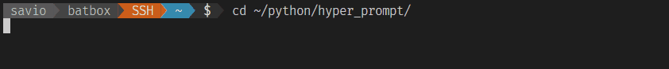

# Hyper-prompt

[](https://pypi.org/project/hyper-prompt/)
[](https://pypi.org/project/hyper-prompt/)
[](https://pypi.org/project/hyper-prompt/)

[](https://isitmaintained.com/project/artbycrunk/hyper-prompt "Average time to resolve an issue")
[](https://isitmaintained.com/project/artbycrunk/hyper-prompt "Percentage of issues still open")

[](https://twitter.com/artbycrunk)
[](https://gitter.im/hyper-prompt/hyper-prompt)


A Highly Customize-able prompt for your shell



## Requirements

- Python3
- Powerline Fonts : https://github.com/powerline/fonts

## Getting Started

* from pip
```bash 
pip install hyper-prompt
```

* from github
```
git clone https://github.com/artbycrunk/hyper-prompt
cd hyper-prompt
python setup.py install
```

## Configure for your desired shell

### * Bash

Add the following to your `.bashrc` file:

```bash
function _update_ps1() {
    PS1=$(hyper-prompt $?)
}

if [[ $TERM != linux && ! $PROMPT_COMMAND =~ _update_ps1 ]]; then
    PROMPT_COMMAND="_update_ps1; $PROMPT_COMMAND"
fi
```

### * Zsh

Add the following to your `.zshrc`:

```zsh
function prompt_precmd() {
    PS1="$(hyper-prompt --shell zsh $?)"
}

function add_prompt_precmd() {
  for s in "${precmd_fn[@]}"; do
    if [ "$s" = "prompt_precmd" ]; then
      return
    fi
  done
  precmd_fn+=(prompt_precmd)
}

if [ "$TERM" != "linux" ]; then
    add_prompt_precmd
fi
```

### * Fish

Add the following to your `~/.config/fish/config.fish`:

```shell
function fish_prompt
    hyper-prompt --shell bare $status
end
```

### * tcsh

Add the following to your `.tcshrc`:

```bash
alias precmd 'set prompt="`hyper-prompt --shell tcsh $?`"'
```

## Customization Options

### Config File

Hyper prompt will lookup multiple locations for a config file for options on how to display your prompt..

It will first look for a `hyper_prompt.json` in your current project/folder, if it doesn't exists look for `$HOME/.hyper_prompt.json` else finally look for `$HOME/.config/hyper_prompt/config.json`

Use `~/.config/hyper-prompt/config.json` as a config file for customizations.

Example of a default config
```json
"theme": "default",
"mode":"patched",
"segments": [
    "username",
    {
        "type": "virtual",
        // a user built segment which is discoverable via the python path
        "module": "hyper_prompt.segments.virtual"
    }
]
```

### Segments

Segments are the building blocks of hyper-prompt

You can mix and match different segments to build your prompt.


## Issues, feature requests, and contributions

* If you come across a problem with the extension, please [file an issue](https://github.com/artbycrunk/hyper-prompt/issues/new)
* Contributions are always welcome!
* Any and all feedback is appreciated and welcome!
  - If someone has already [filed an issue](https://github.com/artbycrunk/hyper-prompt/issues) that encompasses your feedback, please leave a 👍/👎 reaction on the issue
  - Otherwise please file a new issue

## Release Notes

See [CHANGELOG.md](https://github.com/artbycrunk/hyper-prompt/blob/master/CHANGELOG.md)

See [Recent Releases](https://github.com/artbycrunk/hyper-prompt/releases)

**Enjoy!**

