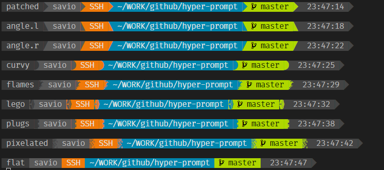

===========================
Segments
===========================

Segments are the building blocks of hyper-prompt

You can mix and match different segments to build your prompt. They can also depends on each other is certain cases.

Segment Configuration
===========================

Each segment can have its only configurable attribute,
if you want to configure a segment beyond its default you can do some like the following example.::

    {
      "segments": [
          "ssh",
          {
              "type": "cwd",
              "show_readonly": true
          },
          {
              "type":"time",
              "show_symbols":false,
              "separator":"patched"
          }
      ]
    }

Separators & Symbols
===========================

Each segment is seperated by a default symbol from the powerline font, this can be changed by the `separator` option in the config.

Available separators options are: patched, angle.l, angle.r, curvy, flames, lego, plugs, pixelated, flat
Refer to the following image of the style of each separator.

Each segment also has the option of displaying symbols, to better represent the segment info, 
this can be globlally toggled using the `show_symbols` option in the config.

All Segments
===========================

cwd
---------------------------

The options for the **cwd** segment are:

- **mode**: If `plain`, then simple text will be used to show the cwd. If `dironly`, only the current directory will be shown. Otherwise expands the cwd into individual directories.
- **max_depth**: Maximum number of directories to show in path.
- **max_dir_size**: Maximum number of characters displayed for each directory in the path.
- **full_cwd**: If true, the last directory will not be shortened when `max_dir_size` is used.

env
---------------------------

var
skip_undefined

git
---------------------------

hostname
---------------------------

newline
---------------------------

root
---------------------------

ssh
---------------------------

time
---------------------------

username
---------------------------

virtualenv
---------------------------